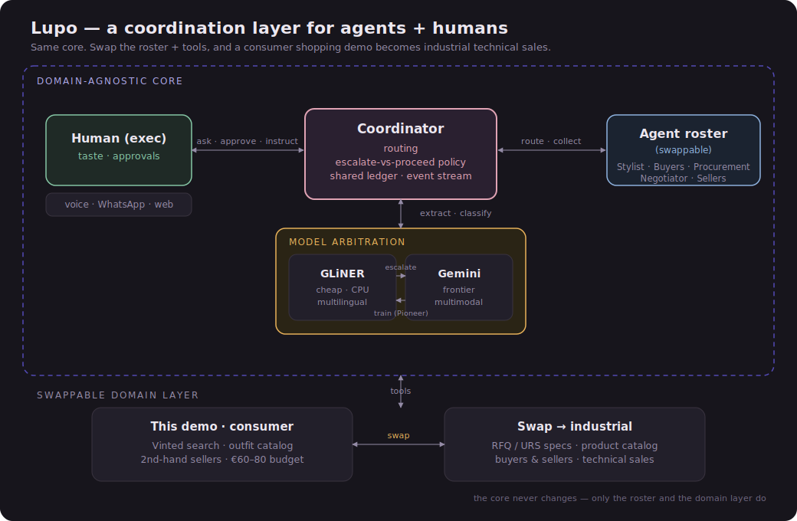

# Lupo

**A coordination layer for agents *and* humans.**

Most AI agents today are a single model calling tools. The interesting, valuable problem
is the layer *above*: coordinating a whole team of agents **and** a person to finish a job
at organisational scale — deciding what to do autonomously, what to confirm, and what to
escalate, while keeping shared state and a budget coherent.

Lupo is that layer. The demo instantiates it as a **personal-shopper org** that assembles
an outfit on Vinted within a budget — but the shopping is just a skin. The core is
domain-agnostic: swap the agent roster and the catalog and the same engine runs
**industrial technical sales** (RFQ → quote), which is the same shape of problem.

---

## What it does (the demo)
You give a brief and a budget. A team of agents — coordinated by a **Coordinator** — styles
an outfit, shops for each piece across multilingual Vinted listings, settles each item
against its budget, and hands you a plan. You stay in the loop at the decisions that matter.

Two scenarios ship, chosen to show two *different* coordination behaviours:

| Scenario | Budget | The conflict | Your choice | What the org does |
|----------|--------|--------------|-------------|-------------------|
| **brunch** | €30 | the standout dress is €4 over its slice | **negotiate** | the Negotiator haggles the seller €15 → €12 |
| **tomorrowland** | €20 | the hero boots are €4 over their slice | **stretch** | Procurement **reallocates** slack from other categories; total stays €20 |

Budgets are deliberately tight — real second-hand Vinted finds are cheap, and people who
shop second-hand shop to a tight budget. The conflict is engineered from *real* cached
prices (see **How the buyer picks** below), not invented numbers.

Three human checkpoints in every run: approve the **vision** (with amendments), approve the
**budget split**, and **confirm** the purchase. The finish is per-item logistics: items from
foreign sellers ship (paid online); only a genuinely local seller becomes an in-person
pickup, with the tram and the exact cash for *that* item.

Everything runs **fully offline and deterministic** by default — cached real listings, a
scripted human, rule-based agent stubs — so the demo never depends on a key or the network.
Real models and services switch on behind toggles.

---

## Quick start
```bash
pip install -r requirements.txt        # only needed for the real integrations; stub mode is stdlib-only
python3 scripts/run_mission.py                              # brunch
LUPO_SCENARIO=tomorrowland python3 scripts/run_mission.py   # tomorrowland
python3 tests/test_mission.py                               # smoke tests
```
Then open the visuals (double-click):
- **`frontend/canvas.html`** — the live coordination canvas. Roster, the coordination
  stream (escalations + your replies), a budget ring, and the outfit filling in. Scenario
  buttons at the top (Brunch / Tomorrowland / Live). *This is the recording surface.*
- **`frontend/walkthrough.html`** — a narrated storyboard of the same run.
- **`frontend/architecture.svg`** — the architecture diagram (for the video).

---

## Architecture



See **`ARCHITECTURE.md`** for the full picture. In short:

**The domain-agnostic core** (never changes between use cases):
- **Coordinator** — the star. Routes work to agents, holds the shared **ledger** (the
  structured state everyone reads/writes), runs the **escalate-vs-proceed policy** (act /
  confirm / ask the human), and arbitrates conflicts over the shared budget.
- **Human-in-the-loop channel** — the human is the exec: sets the brief, owns taste,
  approves spend. Reachable over a swappable channel (voice via Gemini TTS, WhatsApp, web).
- **Model arbitration** — a cheap, multilingual model (**GLiNER2**, via Fastino **Pioneer**)
  does the extraction; hard cases escalate to a frontier model (**Gemini**); the frontier
  answers become training data that sharpens the small model. The escalation bar is set high
  on purpose (confidence < 0.99) so day-1 GLiNER2 escalates aggressively and we **harvest**
  Gemini's corrections as labelled rows — then fine-tune so the small model needs Gemini less.
  This is *shown*, not asserted: on the real cached listings GLiNER2 reads the German `Leder`
  and Italian `pelle` (both *leather*) as style/colour and the Dutch `boho` as a brand; Gemini
  corrects them to `material: leather`/`linen`, and each correction is logged for the LoRA
  fine-tune. A real fine-tune on the harvested rows lifts GLiNER2 from **F1 0.188 → 0.267
  (≈ +42%)** on the held-out eval set. (Full before/after table in **`ARCHITECTURE.md`**.)
- **Agent roster** (swappable) — Stylist, Buyers, Procurement, Negotiator, Sellers.

**The swappable domain layer** — the tools + catalog. Here: Vinted search over an outfit
catalog. Swap it for RFQ/URS specs over a product catalog and the core runs technical sales.

**The same pattern at three scales** — *do the routine, escalate the hard case, learn from
the result*: agent ↔ human, cheap model ↔ frontier model, buyer ↔ seller. That coherence is
what makes it a layer, not a script.

---

## How the buyer picks (the buyer's strategy)
There is one **Buyer** per outfit component (`dress`, `boots`, …); they run in parallel,
each owning a style slice and a sub-budget. A buyer's job is *find the best match* — never
to settle the budget or negotiate (that's Procurement, the Coordinator and the Negotiator).
Its pipeline (`lupo/agents/buyer.py`):

1. **Source candidates** — `vinted.search(query, …)` returns up to 8 listings. Live, it
   hits the real Vinted API (persistent `curl_cffi` Chrome session, throttled with jitter,
   429 back-off) scoped to the **women's catalogue** and the wearer's **size** (clothes
   `M`/`38`, shoes `38`) via `catalog_ids` + size-token filtering; offline it replays the
   curated cache. The query itself falls back progressively (English style tags → French →
   single tag → catalogue+size) so multilingual listings still match.
2. **Extract structure from the mess** — sellers never fill in the fields that matter, so
   for each listing the buyer runs **GLiNER/Pioneer** over the FR/NL/DE/IT/EN title+desc to
   pull `material` / `style` / `fit`. Low-confidence listings **escalate to Gemini**, and
   every escalation is logged as a training sample that later fine-tunes the small model
   (the adaptive-inference loop).
3. **Score style-fit** — `_fit()` overlaps the brief's `style_tags` with the listing text
   **and** the extracted attributes: `0.4 + 0.18 × hits`, capped at `1.0`. Optionally
   (`USE_REAL_VISION`) the top few candidates are re-scored by **Gemini Vision** on the
   actual photo, which overrides the keyword score for the final taste call.
4. **Rank and propose** — candidates are sorted by **`(fit ↓, price ↑)`**: the best style
   match wins, and **price only breaks ties**, so among equally-good matches the buyer takes
   the cheapest. The full ranked set is emitted to the canvas as rich find-cards (photo,
   price, size, language, extracted attrs, fit %, and which one is `best`); the top pick is
   proposed to the Coordinator, which then settles it against the budget.

**Why fit-first, not price-first?** A cheapest-first buyer would grab a €2 plain tee over a
€10 mesh-sparkle top and miss the brief. Fit-first picks the *right* item, and the
shared-budget tension it sometimes creates is exactly the coordination problem Lupo exists
to solve — the standout piece lands over its slice, and the human decides *negotiate* vs
*stretch*.

**Demo curation.** Because the buyer ranks by fit, a single pricey high-fit outlier could
blow a slice and derail the script. `scripts/vinted_live.py narrate <scenario>` shapes each
slot's **real** cached price band (non-hero slots capped at their allocation; the hero slot
kept dear-but-resolvable) and tags each item's seller persona — so the *real* finds reliably
produce the scripted negotiate / stretch beats. Prices are never faked.

Seller **locations are real too**: `narrate --real-countries` looks up each kept seller via
`/api/v2/users/{id}` and records their actual country/city (honouring `expose_location`).
The wearer is Belgian (`LUPO_HOME_COUNTRY=Belgique`), so the genuinely local sellers — the
**Berchem** boots and the **Ekeren** brunch earrings — become in-person pickups, while
everything else ships from where it actually is (France, Netherlands, Germany, Luxembourg…).
Matching is by ISO code (`LUPO_HOME_CODE=BE`) because Vinted localises the country name.

---

## Project structure
```
lupo-orchestrator/
├── lupo/                       # the coordination engine (Python, stdlib-only in stub mode)
│   ├── coordinator.py          # ★ routes work, holds the ledger, runs escalate-vs-proceed,
│   │                           #   arbitrates the budget, drives the human checkpoints + logistics
│   ├── policy.py               # the escalate-vs-proceed policy (PROCEED / CONFIRM / ASK)
│   ├── ledger.py               # shared mission state: Component dataclass + budget ledger
│   ├── events.py               # EventStream -> data/events.jsonl (feeds the canvas) + console echo
│   ├── extract_entities.py     # multilingual attribute extraction; GLiNER stub + real, Gemini escalation
│   ├── llm.py                  # real integrations: Gemini structured output + Gemini TTS (behind toggles)
│   ├── samples.py              # logs GLiNER→Gemini escalations as training samples (Pioneer loop)
│   ├── config.py               # the toggles (all off = offline deterministic demo)
│   ├── agents/
│   │   ├── base.py             # Agent base (emits events)
│   │   ├── stylist.py          # brief -> outfit spec (rule-based stub or Gemini); amendments
│   │   ├── buyer.py            # searches Vinted, runs extraction, emits structured candidates
│   │   ├── procurement.py      # budget allocation + reallocation (stretch)
│   │   └── negotiator.py       # Negotiator.haggle + a simulated Seller by persona
│   ├── human/
│   │   └── channel.py          # HumanChannel: Scripted (offline), Voice (Gemini TTS), WhatsApp, Web, Email
│   ├── missions/
│   │   └── shopping.py         # SCENARIOS (brunch, tomorrowland), run(), traceability()
│   └── vinted/
│       └── client.py           # Vinted search with record/replay; live curl_cffi session, throttled + size/catalog filters
├── data/
│   ├── vinted_cache/*.json     # cached real listings per query (record/replay)
│   ├── events.jsonl            # latest run (the canvas Live tab reads this)
│   ├── events_brunch.jsonl     # stable per-scenario snapshots
│   ├── events_tomorrowland.jsonl
│   └── extraction_eval.jsonl   # labelled multilingual examples for the GLiNER finetune harness
├── frontend/
│   ├── canvas.html             # live coordination canvas (recording surface)
│   ├── walkthrough.html        # narrated storyboard (brunch / tomorrowland / live)
│   └── architecture.svg        # the architecture diagram
├── scripts/
│   ├── run_mission.py          # run a scenario (LUPO_SCENARIO=brunch|tomorrowland)
│   ├── cache_vinted.py         # cache real listings for the exact demo queries (real photos)
│   ├── vinted_live.py          # live fetch + curate/cache; `narrate` shapes price bands + tags country/persona
│   ├── harvest_samples.py      # batch the cached listings through GLiNER2→Gemini to build the training set fast
│   ├── pioneer_finetune.py     # real Pioneer NER LoRA finetune: dataset→train→poll→eval→side-by-side
│   └── finetune_gliner.py      # GLiNER before/after metrics (Fastino prize)
├── tests/test_mission.py       # smoke tests (under budget, amendment applied, negotiation saved money)
├── ARCHITECTURE.md             # the design + why it generalises (video material)
├── IMPLEMENTATION_PLAN.md      # step-by-step to finalise the real integrations
├── VIDEO_SCRIPT.md / VOICEOVER.md   # the submission video script and read-aloud narration
├── BUILD_AND_DEMO.md           # plan, demo script, challenge-fit map, prize plays
└── requirements.txt
```

---

## Configuration (toggles)
Everything off ⇒ fully offline, deterministic. Each real path falls back to the stub on error.

| Variable | Default | Effect |
|----------|---------|--------|
| `LUPO_SCENARIO` | `brunch` | which mission to run (`brunch` \| `tomorrowland`) |
| `USE_REAL_GEMINI` | `0` | stylist spec + extraction escalation via Gemini |
| `USE_REAL_GLINER` | `0` | real `urchade/gliner_multi-v2.1` extraction (else keyword stub) |
| `USE_REAL_VOICE` | `0` | speak human pings via Gemini TTS (rotating tone/language) |
| `LUPO_HUMAN_CHANNEL` | `scripted` | `scripted` \| `voice` \| `whatsapp` \| `web` |
| `LUPO_VINTED_LIVE` | `0` | call the real Vinted client and cache (else replay fixtures) |
| `LUPO_HOME_COUNTRY` / `LUPO_HOME_CODE` / `LUPO_HOME_CITY` | `Belgique` / `BE` / `Berchem` | the wearer's home; sellers here become in-person pickups, the rest ship |
| `GLINER_ESCALATION_THRESHOLD` | `0.99` | below this confidence a listing escalates to Gemini — high by design to harvest training rows; lower it after the finetune to show escalations drop |
| `GEMINI_API_KEY` | — | required when `USE_REAL_GEMINI` / `USE_REAL_VOICE` are on |

Model names live in `lupo/llm.py` (`GEMINI_TEXT_MODEL`, `GEMINI_TTS_MODEL`) — verify them
against your key before the demo.

---

## Partners
- **Gemini** (qualifying) — structured outputs (stylist, extraction escalation) and TTS
  (the voice pings); the arbitration target for hard cases.
- **Fastino / GLiNER** — the small multilingual extractor; **Pioneer** for fine-tuning on
  Lupo's own escalation traces (adaptive inference). Metrics harness: `scripts/finetune_gliner.py`.
- **Aikido** — supply-chain/runtime security scan for the "most secure build" prize;
  prompt-injection resistance is handled by the architecture (Coordinator validates, human confirms).

---

## Testing
```bash
python3 tests/test_mission.py
```
Covers: the outfit lands under budget, the human amendment is applied, the negotiation
saved money, and the event stream is produced.

---

## Why this answers the challenge
The brief asks for more than a single agent calling tools — it asks for the layer that
coordinates agents and humans together at organisational scale. Every hard part here lives
in the core and assumes nothing about fashion: a spec compiler (Stylist), an escalation
policy (Coordinator), shared-budget procurement, traceability, and model arbitration.
Change the roster and the domain layer, and the outfit shopper becomes industrial
procurement. **The coordination layer is the product; the outfit is just the demo.**
